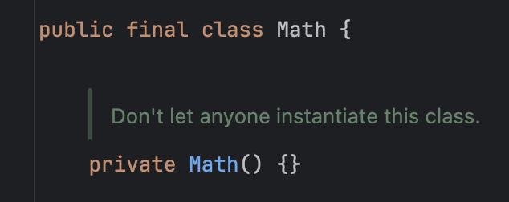

# Item 04 - 인스턴스화를 막으려거든 private 생성자를 사용하라

## Intro

객체 지향 프로그래밍은 속성과 행위를 객체라는 하나의 단위로 묶고 객체들의 상호작용을 통해 프로그래밍하는 방법이다. 하지만 때로는 정적 필드와 정적 메서드만 담은 클래스를 사용하고 싶을 때가 있다.

Java에서도 이런 클래스를 제공하는데 [java.lang.Math](https://docs.oracle.com/en/java/javase/21/docs/api/java.base/java/lang/Math.html)는 수학 관련 상수와 연산들을 편하게 사용할 수 있게 해주고, [java.util.Arrays](https://docs.oracle.com/en/java/javase/21/docs/api/java.base/java/util/Arrays.html)는 배열을 조작하는 다양한 메서드를 사용할 수 있게 모아놨다. 컬렉션에서 사용할 수 있는 [java.util.Collections](https://docs.oracle.com/en/java/javase/21/docs/api/java.base/java/util/Collections.html)도 있다. 이외에도 상속이 불가능한 final 클래스와 관련된 메서드들을 모아놓을 때도 사용한다.(상속 받아 기능을 확장하는 것이 불가능하기 때문인 것으로 보인다.)

이런 정적 필드와 정적 메서드만 담은 유틸리티 클래스는 인스턴스로 만들어 쓰려고 설계한 것이 아니기 때문에 외부에서 인스턴스로 만들어 사용하는 것을 막아야 한다.

---

## V1

```java
public class PrintUtilV1 {

    public static void print(String msg) {
        System.out.println(msg);
    }
}
```

```java
public class PrintUtilV1Main {

    public static void main(String[] args) {
        PrintUtilV1.print("hello java V1");  // hello java V1

        /*
         * 생성자를 명시하지 않으면 컴파일러가 자동으로 기본 생성자를 만들어 준다.
         * 유틸리티 클래스를 인스턴스화해서 사용하는 것은 원하는 사용 방식이 아니다.
         * 인텔리제이가 경고도 해줌(Instantiation of utility class 'PrintUtilV1')
         */
        PrintUtilV1 p1 = new PrintUtilV1();
    }
}
```

---

## V2

```java
public abstract class PrintUtilV2 {

    public final String info = "PrintUtilV2";

    public static void print(String msg) {
        System.out.println(msg);
    }
}
```

```java
public class PrintUtilV2Child extends PrintUtilV2 {

    public final String info = "PrintUtilV2Child";

    // 정적 메서드는 오버라이딩이(overriding) 아니라 하이딩(hiding)
    public static void print(String msg) {
        System.out.println(msg);
    }
}
```

```java
public class PrintUtilV2Main {

    public static void main(String[] args) {
        PrintUtilV2.print("hello java V2");  // hello java V2

        // 추상 클래스로 선언해서 인스턴스화를 방지할 수 있다.
//        PrintUtilV2 p2 = new PrintUtilV2();

        // 하지만 상속 받아서 인스턴스화할 수 있고 추상 클래스로 선언하면 상속 받아 사용하라는 의도로 비춰질 수 있다.
        PrintUtilV2 p2 = new PrintUtilV2Child();
        System.out.println("p2.info = " + p2.info);  // p2.info = PrintUtilV2

        PrintUtilV2Child p3 = (PrintUtilV2Child) p2;
        System.out.println("p3.info = " + p3.info);  // p3.info = PrintUtilV2Child

        // 물론 익명 클래스로도 인스턴스화가 가능하다.(추상 메서드가 없어서 본문은 비움)
        PrintUtilV2 p4 = new PrintUtilV2() {
        };

        System.out.println("p4 = " + p4);  // p4 = PrintUtilV2Main$1@723279cf
        System.out.println("p4.info = " + p4.info);  // p4.info = PrintUtilV2
    }
}
```

---

## V3

```java
public class PrintUtilV3 {

    public final String info = "PrintUtilV3";

    private PrintUtilV3() {
    }

    public static void print(String msg) {
        System.out.println(msg);
    }
}
```

```java
import java.lang.reflect.Constructor;
import java.lang.reflect.InvocationTargetException;

public class PrintUtilV3Main {

    public static void main(String[] args) throws NoSuchMethodException, InvocationTargetException, InstantiationException, IllegalAccessException {
        PrintUtilV3.print("hello java V3");  // hello java V3

        /*
         * private 생성자 덕분에 외부에서 인스턴스화하는 것을 방지할 수 있다.
         * 또한 이를 상속 받고자 하는 클래스가 부모 클래스의 생성자(super())를 호출할 수 없어서 상속을 통한 인스턴스화도 방지된다.
         */
//        PrintUtilV3 p3 = new PrintUtilV3();

        // 리플렉션으로 만들 수 있기도 함
        Class<PrintUtilV3> clazz = PrintUtilV3.class;  // PrintUtilV3의 Class 객체를 가져옴
        Constructor<PrintUtilV3> cons = clazz.getDeclaredConstructor();  // 기본 생성자를 가져옴(접근 제어자에 상관없이)
        cons.setAccessible(true);  // private에 접근하는 설정
        PrintUtilV3 p3 = cons.newInstance();  // 인스턴스 생성

        System.out.println("p3 = " + p3);  // p3 = PrintUtilV3@5f184fc6
        System.out.println("p3.info = " + p3.info);  // p3.info = PrintUtilV3
    }
}
```

---

## V4

```java
public class PrintUtilV4 {

    private PrintUtilV4() {
    }

    public static void print(String msg) {
        // private 생성자여도 해당 클래스 내부에서는 호출할 수 있으니 이것도 완전히 막으려면 예외를 던지자
        PrintUtilV4 p4 = new PrintUtilV4();
        System.out.println("p4 = " + p4);
        System.out.println(msg);
    }
}
```

```java
public class PrintUtilV4Main {

    public static void main(String[] args) {
        PrintUtilV4.print("hello java V4");
        // p4 = PrintUtilV4@5f184fc6
        // hello java V4
    }
}
```

---

## Etc.

Java의 유틸리티 클래스에도 잘 적용되어 있다.




AES 암호화 알고리즘 관련 유틸리티 클래스를 작성했을 때 적용했었다.


---
