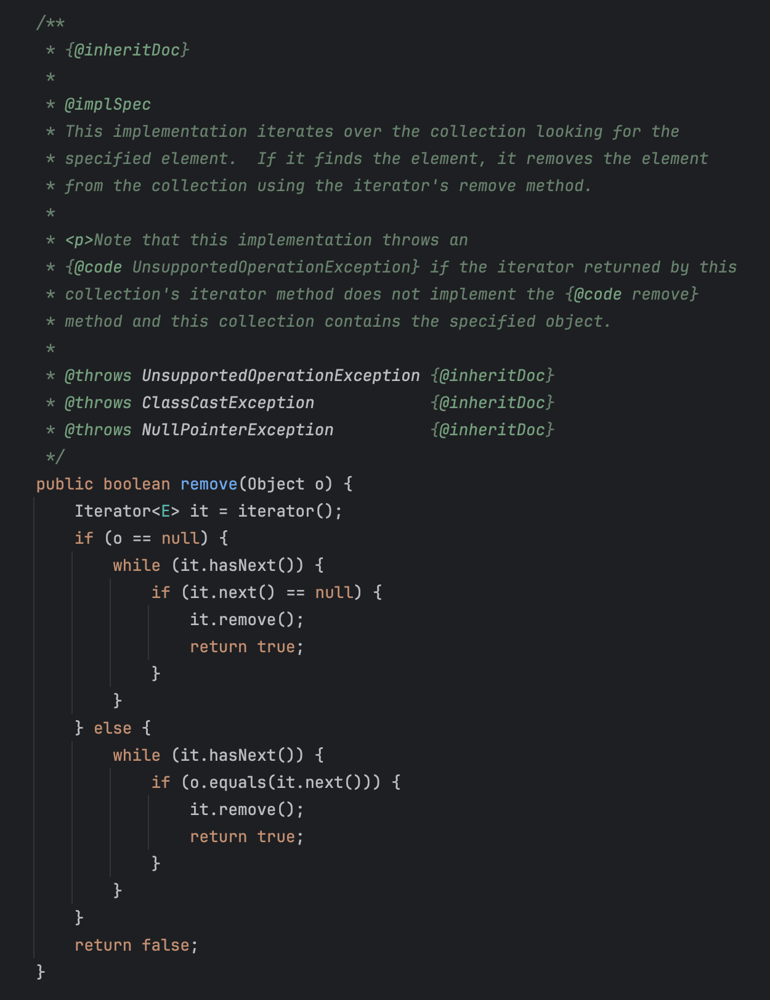

# Item 19 - 상속을 고려해 설계하고 문서화하라. 그러지 않았다면 상속을 금지해라

## 상속을 고려한 설계와 문서화

상속용 클래스는 재정의할 수 있는 메서드들을 내부적으로 어떻게 이용하는지 문서로 남겨야 한다. API로 공개된 메서드에서 재정의할 수 있는 메서드를 호출하는 경우 이를 API 설명에 적시해야 한다. 덧붙여 어떤 순서로 호출하는지, 각각의 호출 결과가 이어지는 처리에 어떤 영향을 주는지도 담아야 한다.

아래는 [java.util.AbstractCollection](https://docs.oracle.com/en/java/javase/21/docs/api/java.base/java/util/AbstractCollection.html)의 [remove](<https://docs.oracle.com/en/java/javase/21/docs/api/java.base/java/util/AbstractCollection.html#remove(java.lang.Object)>) 메서드로 상속에 대해 상세하게 자바독으로 설명이 되어 있는 것을 볼 수 있다.



또한 상속을 허용하는 클래스의 생성자는 재정의 가능 메서드를 호출하면 안 된다. 상위 클래스의 생성자가 하위 클래스의 생성자보다 먼저 실행되므로 하위 클래스에서 재정의한 메서드가 하위 클래스의 생성자보다 먼저 호출된다. 이때 해당 메서드가 하위 클래스의 생성자에서 초기화하는 값에 의존하면 예상치 못한 동작을 할 수 있다.

아래는 `Super` 클래스와 이를 상속한 `Sub` 클래스로 `Super` 클래스는 생성자에서 `override` 메서드를 호출하고 있으며 이 메서드는 재정의 가능 메서드다. `Sub` 클래스는 `override` 메서드를 재정의했으며 하나의 필드를 갖고 이를 생성자에서 초기화한다.

```java
public class Super {

    public Super() {
        System.out.println("Super.Super");
        override();
    }

    public void override() {
        System.out.println("Super.override");
    }
}

public class Sub extends Super {

    private final Instant instant;

    public Sub() {
        System.out.println("Sub.Sub");
        instant = Instant.now();
    }

    @Override
    public void override() {
        System.out.println("Sub.override");
        System.out.println(instant);
    }
}
```

이런 상황일 때 `Sub` 인스턴스를 생성하고 `override` 메서드를 호출하는 상황을 상상해보자. 먼저, `Sub sub = new Sub();`를 통해 인스턴스를 생성하면 `Sub`의 생성자에서 부모의 생성자를 먼저 호출한 후 생성자 로직을 수행하게 된다. 이때 부모 생성자는 `override` 메서드를 호출하고 이 메서드는 오버라이딩된 메서드라서 `Sub` 클래스의 `override`가 실행된다. 이때는 아직 `instance`를 초기화하기 전이므로 결국 `null`이 출력된다. 단순 출력이 아닌 다른 로직이었다면 NPE가 발생할 수도 있었다. 재정의가 불가능한 메서드의 경우 안심하고 호출해도 된다.(`private`, `final`, `static`)

```java
public class SuperSubMain {

    public static void main(String[] args) {
        Sub sub = new Sub();
        // Super.Super
        // Sub.override
        // null
        // Sub.Sub

        sub.override();
        // Sub.override
        // 2025-10-15T21:27:13.105694Z
    }
}
```

생성자뿐만 아니라 비슷한 효과를 내는 `clone`과 `readObject` 메서드 역시 주의해야 한다. 복제본의 상태를 올바르게 수정하기 전이나 역직렬화되기 전에 재정의한 메서드가 호출되기 때문이다.

---

## 핵심 정리

상속용으로 설계하지 않은 클래스는 상속을 금지하는 것이 간단한 해결책이다. 상속용 클래스를 설계하는 것은 만만치 않은 작업이며 클래스 내부에서 사용되는 방식을 모두 문서로 남기고 책임을 져야 한다. 클래스를 확장해야 할 명확한 이유가 없다면 상속을 금지하는게 나은 선택이다.

---
