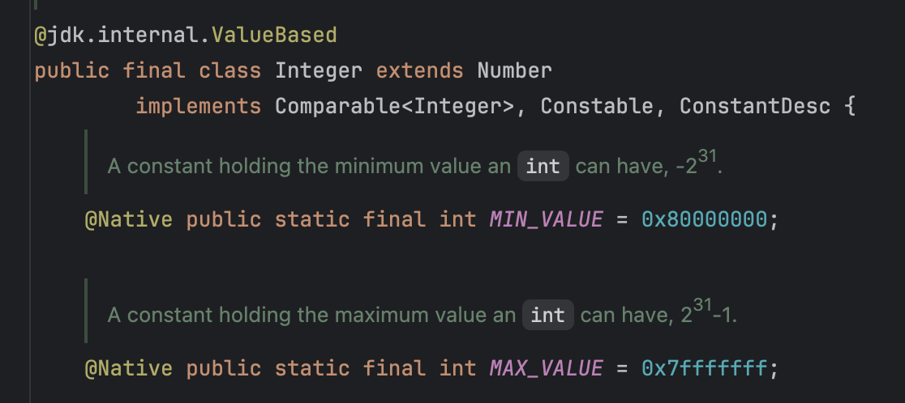

# Item 22 - 인터페이스는 타입을 정의하는 용도로만 사용하라

## Intro

인터페이스는 자신을 구현한 클래스의 인스턴스를 참조할 수 있는 타입 역할을 한다. 달리 말해, 클래스가 어떤 인터페이스를 구현한다는 것은 자신의 인스턴스로 무엇을 할 수 있는지 클라이언트에 얘기해주는 것이다. 인터페이스는 오직 이 용도로만 사용해야 한다.

---

## 안티 패턴 - 상수 인터페이스

상수 인터페이스란 메서드 없이, 상수를 뜻하는 `static final` 필드로만 가득 찬 인터페이스를 말한다.(인터페이스의 필드는 `public static final`로 간주된다고 한다 from [JSL 9.3](https://docs.oracle.com/javase/specs/jls/se21/html/jls-9.html#jls-9.3))

아래처럼 상수 필드만 갖는 인터페이스를 선언하면 이를 구현한 클래스는 인터페이스의 상수 값을 쉽게 가져와서 쓸 수 있다.

```java
public interface PhysicalConstants {

    // 아보가드로 수 (1/몰)
    double AVOGADROS_NUMBER = 6.022_140_857e23;

    // 볼츠만 상수 (J/K)
    double BOLTZMANN_CONSTANT = 1.380_648_52e-23;

    // 전자 질량 (kg)
    double ELECTRON_MASS = 9.109_383_56e-31;
}

public class UserConstants implements PhysicalConstants {

    public double getAN() {
        return AVOGADROS_NUMBER;
    }

    public double getBC() {
        return BOLTZMANN_CONSTANT;
    }

    public double getEM() {
        return ELECTRON_MASS;
    }
}
```

하지만 이는 인터페이스를 잘못 사용한 예다. 클래스 내부에서 사용하는 상수는 외부 인터페이스가 아니라 내부 구현에 해당한다. 따라서 상수 인터페이스를 구현하는 것은 이 내부 구현을 클래스의 API로 노출하는 행위다. 추후 이런 상수들을 쓰지 않게 되더라도 호환성을 위해 여전히 상수 인터페이스를 구현하고 있어야 한다. 또한 해당 클래스를 다른 클래스가 상속할 경우 하위 클래스는 인터페이스가 정의한 상수명으로 이름공간이 오염된다.

상수를 공개할 목적이라면 합당한 선택지들이 있는데 특정 클래스나 인터페이스와 강하게 연관된 상수라면 그 클래스나 인터페이스 자체에 추가해야 한다. `INTEGER.MAX_VALUE` 같은 상수가 여기에 해당한다. 열거 타입이 적합하면 열거 타입을 활용해도 되며, 그것도 아니라면 유틸리티 클래스로 공개하는 것이 좋다.



---
